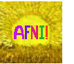

   

## Staff Scientist Position in the Scientific and Statistical Computing Core (SSCC, NIMH, NIH, USA)
See also: 
* [Data Scientist Position in the Data Science and Sharing Team](https://github.com/nih-fmrif/dataSci_job_ad)
* [Data Scientist Position in the Sections on Neural Function and Fundamental Neuroscience](https://github.com/nih-fmrif/mcrscpy_dataSci_job)

The National Institute of Mental Health (NIMH) is the largest funder of research on mental disorders in the world, with a current budget of over $1.4B. Our mission is to transform the understanding and treatment of mental illnesses through basic and clinical research, paving the way for prevention, recovery, and cure. The NIH is a highly rated employer at glassdoor.com with very competitive salary and benefits packages.

The SSCC develops and maintains [AFNI](https://afni.nimh.nih.gov), one of the most widely used brain imaging packages used in MRI analysis across the world.  We also collaborate directly with groups at NIH and around the globe on neuroimaging projects, and teach several week-long training courses in brain imaging methods (colloquially referred to as "Bootcamps") around the globe.  

<b>We are looking for a technically-minded and motivated person to work on scientific/statistical computing applied to brain imaging.</b>

#### What you will be doing

Example projects include (but are not limited to):

+ Extending AFNI's visualization interfaces to web-capable graphics technologies.
+ Lead the development of [SUMA](https://afni.nimh.nih.gov/pub/dist/doc/htmldoc/SUMA/cover.html), our surface-based analysis and rendering tool.
+ Work interactively with SSCC members on ongoing projects, and develop one's own research line (e.g., pipeline development, visualization, new methodologies, etc.).

#### Desired background

The ideal applicant would have one or more of the following properties:

+ Scientific computing, particularly the use of C/C++ and Python. 
+ Experience in graphics development (or a desire to learn it). Examples of relevant software would include Vulkan, WebGL, or Unity.
+ Experience in computational linear algebra.
+ An interest in "problem solving" both independently and collaboratively.

This position is initially a 1 year appointment, normally renewable 2 times (for a total duration of 3 years).
We are looking for someone to start as soon as practicable, but the timing is flexible.
More information on NIMH fellowship programs can be found at the [NIMH website](https://www.nimh.nih.gov/labs-at-nimh/scientific-director/office-of-fellowship-and-training/fellowships-and-training-programs/index.shtml).

#### Who we are
Our Core is mainly comprised of people with backgrounds in the fields of math, physics, engineering, statistics, computer science, and neuroscience.  
We develop open source, publicly available tools for the neuroimaging community, and we routinely run hands-on training workshops in MRI analysis methods (mainly FMRI and DTI).  
In all cases, work is done in collaboration with NIH researchers to ensure that the resulting methods and software are useful and usable.  

We are located at the National Institutes of Health in Bethesda, MD, USA, in the ever-interesting Washington, DC, metropolitan area.

#### Interested?
<b>Please send:</b> any queries and/or a cover letter of interest (including descriptions of your programming experience, projects worked on, teaching, etc.) and a copy of your CV to:  paul.taylor@nih.gov.

Contacts:  Drs. Robert Cox (Core leader) and Paul Taylor 
